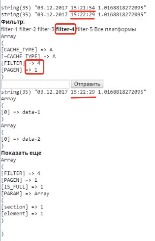
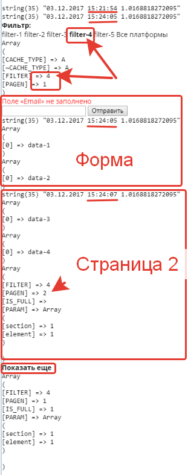

# Ajax загрузчик

## Ajax враппер для списков, форм - project.ajax:wrapper

- загружает формы, компаненты, без вызова всего тела страницы
- можно передавать параметр PARAM
- позволяет последовательно загружать элементы с других компанентов (с пагинацией)
- фильтр по параметру, для списка

```php
$APPLICATION->IncludeComponent("project.ajax:wrapper", ".default", array(
    'PARAM' => array(
        'section' => 1,
        'element' => 1,
    )
));
```





```php
$APPLICATION->IncludeComponent("project.ajax:wrapper", "callback.webform", array());
```